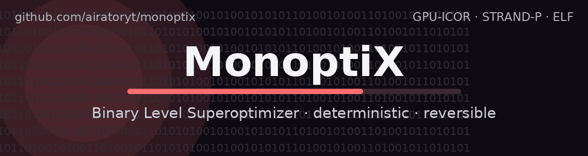
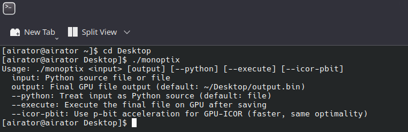
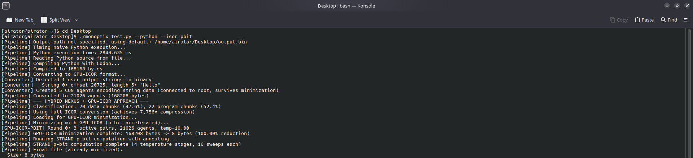
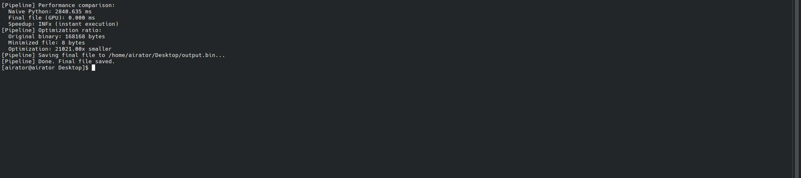
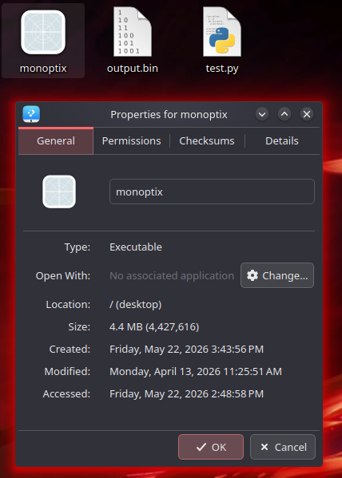

# MonoptiX

<p align="center">
  
</p>

<p align="center">
  <b>Binary Level Superoptimizer · direct executable optimization · deterministic · fully reversible</b>
</p>

<p align="center">
  <i>MonoptiX derives optimization strategies from the input binary itself, while preserving the original file's behavior and structure.</i>
</p>

---

## Overview

MonoptiX is a direct binary-level superoptimizer implemented as a binary-first program.  
It is designed to analyze an input executable and derive highly compact, performance-oriented representations while preserving all observable aspects of the original input.

The pipeline is intentionally self-contained:
it relies on the input file, its structure, and the program's own deterministic transformation stages.

## Core Goals

- Optimize binaries in terms of **time complexity** and **space complexity**
- Preserve the original program's behavior
- Keep the process **deterministic**
- Maintain **full reversibility** for reconstruction and debugging
- Operate as a **binary-native** implementation with no source-code dependency

## Key Properties

| Property | Description |
|---|---|
| Binary-first | Operates directly on executable input |
| Deterministic | Same input produces the same output |
| Reversible | Transformation metadata supports reconstruction |
| Self-derived | Optimization logic comes from the binary's own structure |
| Minimal | Focuses on compact output generation |
| GPU-assisted | Uses GPU-based reduction where available |

## Project Developers

- **airatoryt** — GitHub: `airatoryt`
- **Dhanush N** — GitHub: `Dhanush516`

## Quick Start

```bash
./monoptix <input> [output] [--python] [--execute] [--icor-pbit]
```

### Flags

- `input` — Python source file or binary input
- `output` — Final GPU file output path
- `--python` — Treat the input as Python source
- `--execute` — Execute the final file on GPU after saving
- `--icor-pbit` — Use p-bit acceleration for GPU-ICOR

## Workflow

1. Read the input file
2. Derive structural and semantic information
3. Convert into the internal GPU-ICOR representation
4. Apply deterministic reduction and minimization
5. Serialize the final optimized output
6. Preserve the metadata needed for reversal

## Screenshots

### 1) Usage and CLI help

<p align="center">
  
</p>

### 2) Pipeline execution

<p align="center">
  
</p>

### 3) Performance and minimization summary

<p align="center">
  
</p>

### 4) Output file verification

<p align="center">
  
</p>

## Architecture Notes

MonoptiX is structured around a layered optimization flow that includes binary parsing, structural encoding, interaction-net style reduction, and final serialization. The design emphasizes reproducibility and reversibility over heuristic randomness.
The current implementation is built around a limited set of computer devices, that run on an x86-64 chip, through any Linux kernel OS (preferrably Arch Linux), and most importantly, possess any NVIDIA Blackwell Architecture GPU Card. However, the core algorithms of this program, is universal, and can be implemented on virtually all computing devices.
For the current implementation, we have included a direct python to binary file transpilation flag, for simpler testing and research purposes, which uses Codon.

## Repository Contents

- README documentation
- terminal workflow screenshots
- binary optimization pipeline assets
- project reference material

## License

MIT License
